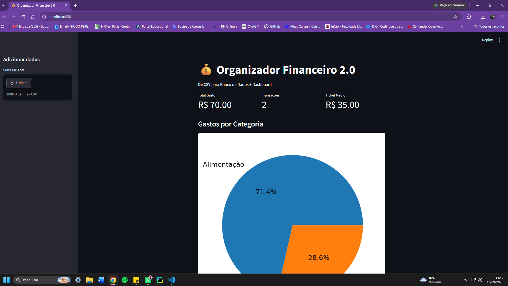

### 🚀 Demonstração ao vivo
https://organizador-financeiro-6sxv3wz8fjsmspqjqdutku.streamlit.app/

# 💰 Organizador Financeiro 2.0

> Sistema completo de análise de gastos com Python, SQLite e Dashboard Web.


### 📊 O que o projeto faz
- ETL: Lê arquivos CSV de gastos
- Armazena em banco de dados SQLite (não fica só na memória)
- Dashboard interativo com métricas, gráfico de pizza e tabela
- Deploy na nuvem com Streamlit Cloud

### 🛠️ Tech Stack
`Python` `Pandas` `SQLite3` `Streamlit` `Matplotlib`

### 📈 Evolução do projeto
- **v1.0:** Script em Python + Pandas + Matplotlib
- **v2.0:** Sistema com Banco de Dados + Dashboard Web + Deploy (ATUAL)

### ▶️ Como rodar local
```bash
pip install -r requirements.txt
streamlit run app.py

Feito por Hugo Ramalho - em transição para Dados
